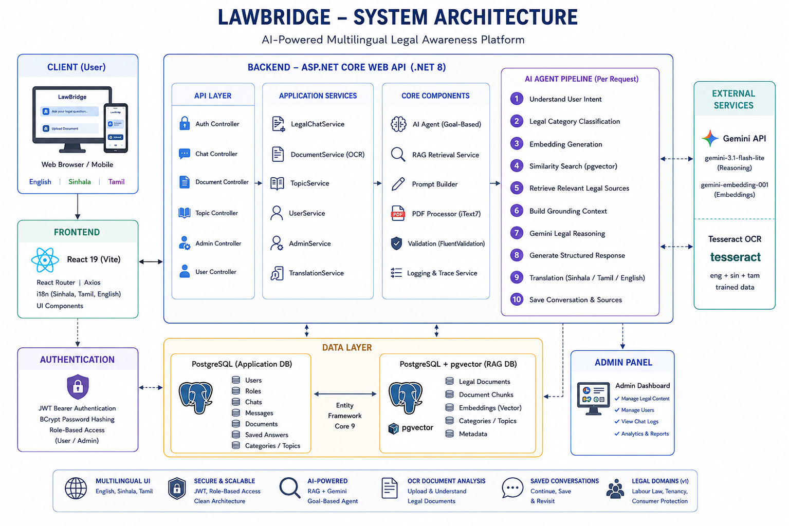

# ⚖️ LawBridge

> **AI-Powered Multilingual Legal Awareness Platform for Sri Lankan Citizens**

**IDEALIZE 2026 – Team CodeNova**
**Category:** Open Category (Web)

---

## 📌 Project Purpose

Many Sri Lankan citizens face legal issues — unpaid salaries, EPF disputes, tenancy conflicts, and consumer rights violations — but don't know their legal rights or the correct first step to take. Legal information is often written in complex legal language, expensive to obtain through professional consultation, and rarely available in Sinhala or Tamil.

**LawBridge** is a multilingual legal awareness platform that helps users understand legal issues through plain-language explanations, document analysis, and practical first-step guidance — in Sinhala, Tamil, and English.

LawBridge does **not** replace lawyers. It helps citizens understand their situation and identify the right next step before seeking professional legal advice.

The current prototype focuses on three legal domains:

- Labour Law
- Tenancy Issues
- Consumer Protection

---

## 🧠 Why an AI Agent, Not a Chatbot

Instead of answering purely from an LLM's memory, every question LawBridge receives goes through a real multi-step reasoning pipeline — retrieval-augmented, classified, source-grounded, and self-correcting rather than a single prompt-in/response-out wrapper. This is detailed in [AI Agent Workflow](#-ai-agent-workflow-open-category) below.

---

## ✨ Core Features

### 🤖 AI Legal Chat Assistant
Ask legal questions in Sinhala, Tamil, or English and receive structured, source-grounded legal explanations, with follow-up questions handled conversationally within the same thread.

### 🏷️ Legal Issue Classification
Every question is classified into a legal category before retrieval, so search is scoped to the right area of law.

### 📚 RAG-Based Legal Information Retrieval
Answers are generated from Sri Lankan legal knowledge retrieved via vector similarity search (pgvector), not solely from the model's own memory.

### ❓ Clarification Guardrail
If a question is too vague to answer safely, the agent asks a clarifying question instead of guessing — and correctly resumes the full structured answer once the user responds.

### 📄 OCR Document Analysis
Users can upload legal notices, agreements, and contracts. Tesseract OCR (English, Sinhala, Tamil trained data) extracts the text, and the AI explains it in plain language.

### 🔍 Legal Topics Browser
Hybrid search (exact keyword + semantic vector search) across legal categories and documents, with per-language filtering and "related" match badges.

### 💾 Saved Conversations & Chat History
Conversations are grouped by thread, can be saved, revisited, or deleted.

### 👤 User Profile Management
Registration, login, profile details, and profile picture management.

### 🔐 Admin Dashboard
Administrators can manage legal topics and categories (with per-language translations), review uploaded documents, manage users, view AI chat logs across all users, and monitor platform analytics (questions asked, popular legal topics, most-viewed documents).

### 🌐 Multilingual Interface
The full application UI — not just AI answers — supports English, Sinhala, and Tamil.

---

## 🏗️ System Architecture



<details>
<summary>Text version</summary>

```text
                    User
                      │
                      ▼
           React Frontend (Vite)
                      │
               REST API (HTTPS)
                      │
                      ▼
       ASP.NET Core Web API (.NET 8)
                      │
        ┌─────────────┼─────────────┐
        ▼             ▼             ▼
 Authentication    OCR Service    AI Agent
  JWT + BCrypt    Tesseract OCR   Gemini API
        │                           │
        │                           ▼
        │                 Intent Classification
        │                           │
        │                           ▼
        │                   Embedding Generation
        │                           │
        │                           ▼
        │                 pgvector Similarity Search
        │                           │
        │                           ▼
        │                Grounded Legal Reasoning
        │                           │
        └──────────────► PostgreSQL Databases
               Users • Chats • Documents • Legal Knowledge
```

Two separate PostgreSQL databases are used: `LawBridge` (users, chats, documents, categories) and `LawBridgeRAG` (pgvector store for legal chunk embeddings).

</details>

---

## 🛠️ Tech Stack

| Layer | Technology |
|---|---|
| Frontend | React 19, Vite, React Router v7, Axios |
| Backend | ASP.NET Core Web API (.NET 8) |
| Database | PostgreSQL (two databases) |
| Vector Search | pgvector |
| ORM | Entity Framework Core 9 |
| AI Reasoning | Google Gemini (`gemini-3.1-flash-lite`) |
| Embeddings | Gemini `gemini-embedding-001` (truncated to 1536 dims) |
| OCR | Tesseract OCR (`eng`, `sin`, `tam` trained data) |
| Authentication | JWT Bearer + BCrypt |
| PDF Processing | iText7 |
| Validation | FluentValidation |
| API Documentation | Swagger / OpenAPI |

> The original proposal listed Gemini, OpenAI, and Claude as candidate AI providers. The team settled on the Gemini API for the prototype — see [Pivots From the Original Proposal](#-pivots-from-the-original-proposal) below.

---

## 🤖 AI Agent Workflow (Open Category)

LawBridge uses a **Goal-Based Legal Guidance Agent**. Every request executes a real multi-step reasoning pipeline — no step is simulated — and each stage is recorded in a live **Agent Trace** returned with the answer, so users can see exactly what the agent did.

**Chat pipeline:**

```text
User Question
      │
      ▼
Understand User Intent (follow-up? clarification answer? new question?)
      │
      ▼
Legal Category Classification
      │
      ▼
Embedding Generation (Gemini)
      │
      ▼
pgvector Similarity Search (scoped to classified category)
      │
      ▼
Retrieve Relevant Legal Sources
      │
      ▼
Build Grounding Context
      │
      ▼
Gemini Legal Reasoning → Structured JSON Answer
      │
      ▼
Guardrail Check (ask a clarifying question if too vague)
      │
      ▼
Translation (English-first, then verified translation if needed)
      │
      ▼
Save to Conversation Memory (threaded by ConversationId)
```

**Document explanation pipeline:**

```text
Upload Document (PDF / JPG / PNG)
      │
      ▼
OCR Text Extraction (Tesseract, eng+sin+tam combined)
      │
      ▼
Legal Context Retrieval (pgvector)
      │
      ▼
AI Explanation + First-Step Guidance
      │
      ▼
Translation (if required)
      │
      ▼
Save Document History
```

**Agent Trace stages exposed to the user:** `classify → embed → retrieve → sources → context → reason → guardrail → clarify → translate → memory`

---

## 📁 Repository Structure

```text
LawBridge
│
├── LawBridge.Frontend
│   ├── src
│   │   ├── pages        (admin, auth, user)
│   │   ├── components
│   │   ├── services
│   │   ├── context       (e.g. language context)
│   │   ├── i18n
│   │   └── layouts
│   └── package.json
│
├── LawBridge.Backend
│   ├── Controllers
│   ├── Services
│   ├── Repositories
│   ├── Interfaces
│   ├── Models
│   ├── DTOs
│   ├── Validators
│   ├── Migrations
│   ├── Data              (AppDbContext, RagDbContext)
│   ├── tessdata           (eng, sin, tam)
│   └── Program.cs
│
└── README.md
```

---

## ⚙️ Setup Instructions

### Prerequisites

- .NET 8 SDK
- Node.js 18+
- PostgreSQL 14+ with the `pgvector` extension
- A Gemini API key

### 1. Database

Create two PostgreSQL databases:

```sql
CREATE DATABASE "LawBridge";
CREATE DATABASE "LawBridgeRAG";

\c LawBridgeRAG
CREATE EXTENSION IF NOT EXISTS vector;
```

### 2. Backend

```bash
cd LawBridge.Backend
dotnet restore
```

Configure `appsettings.json` with:

- `ConnectionStrings:DefaultConnection` and `ConnectionStrings:RagConnection`
- `Jwt:Key` / `Issuer` / `Audience`
- `Gemini:ApiKey`, `EmbeddingModel`, `ChatModel`

> ⚠️ **Do not commit real secrets.** Use a placeholder key in the repo and keep the real key in a local, git-ignored `appsettings.Development.json` or environment variable before pushing/submitting.

Apply migrations to both databases:

```bash
dotnet ef database update --context AppDbContext
dotnet ef database update --context RagDbContext
```

Run the API:

```bash
dotnet run
```

Swagger UI is available once the API is running.

### 3. Frontend

```bash
cd LawBridge.Frontend
npm install
npm run dev
```

Frontend runs on `http://localhost:5173`.

### 4. Login

- **Users**: register a new account from the Register page (`http://localhost:5173/register`), then log in at `http://localhost:5173/login`.
- **Admins**: navigate to `http://localhost:5173/admin/login`, which authenticates against `POST /api/admin/auth/login` and routes to the protected `/admin/dashboard` on success.

---

## 📡 API Overview

### Authentication
```
POST /api/auth/register
POST /api/auth/login
POST /api/auth/logout
```

### Chat
```
POST   /api/chat/ask
GET    /api/chat/history
GET    /api/chat/conversations/{conversationId}
DELETE /api/chat/conversations/{conversationId}
PUT    /api/chat/history/{id}/save
GET    /api/chat/saved
```

### Documents
```
POST   /api/documents/upload
GET    /api/documents
GET    /api/documents/{id}
DELETE /api/documents/{id}
```

### Legal Topics
```
GET /api/topics/categories
GET /api/topics/categories/{id}/documents
GET /api/topics/documents/{id}
GET /api/topics/search
```

### User Profile
```
GET  /api/users/profile
PUT  /api/users/profile
POST /api/users/profile-picture
PUT  /api/users/change-password
```

### Admin
```
POST   /api/admin/auth/login
GET    /api/admin/dashboard/stats
GET    /api/admin/documents
POST   /api/admin/documents/upload
GET    /api/admin/categories
GET    /api/admin/users
GET    /api/admin/chat-logs
```

---

## 🔐 Security

- JWT Bearer authentication
- BCrypt password hashing
- Role-based, protected admin routes
- FluentValidation on inputs
- Environment/config-based secret management

---

## ⚖️ AI Safety

LawBridge is designed for **legal awareness**, not legal advice. The agent:

- Grounds every answer in retrieved Sri Lankan legal information (RAG), rather than answering from model memory alone
- Asks a clarifying question when the user's input is too ambiguous to answer safely, instead of guessing
- Consistently reminds users to consult a qualified legal professional for their specific case

---

## 🔁 Pivots From the Original Proposal

The overall architecture, tech stack category, and project vision remain consistent with the original proposal. The original proposal listed Gemini, OpenAI, and Claude as candidate AI providers; the team implemented the prototype using the **Gemini API** (`gemini-embedding-001` for embeddings, `gemini-3.1-flash-lite` for reasoning) — one of the originally proposed options, selected for its multilingual output quality.

Two enhancements were added during implementation, beyond the original proposal:

1. **Live AI Agent Trace**: every request returns its full step-by-step reasoning trace, so the agent's decision-making is visible rather than a black box.
2. **Clarification guardrail**: the agent asks a follow-up question on ambiguous input instead of repeatedly guessing or looping.

These changes improve reliability and transparency without changing LawBridge's original objectives.

---

## 🚀 Future Plans

- Additional legal domains: Family Law, Land Law, Business Law, Traffic Law
- Voice-based legal assistant
- Mobile application
- Lawyer directory and referral integration
- Government service integration
- Admin-side auto-translation for newly uploaded legal documents (Sinhala/Tamil coverage gap)
- NGO and university legal-aid partnerships

---

## 👥 Team CodeNova

| Name | Institution |
|---|---|
| Pratheesa S | SLIIT |
| Tharumina A V G R | SLIIT |
| Viduranga H B R S | SLIIT |
| Wickramaarachchi D S | SLIIT |
| Jenitha J M | SLIIT |

---

## ⚠️ Disclaimer

LawBridge does not replace lawyers. Its purpose is to improve legal awareness by helping citizens understand legal issues, identify relevant legal information, and take the correct first step before consulting a qualified legal professional.

---

*Developed by Team CodeNova for the IDEALIZE 2026 Open Category *
